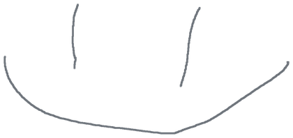

# netwatch

A list of what was watched and listened to on this machine. YouTube, Twitch,
Kinopoisk, Okko, Netflix, Prime Video, TikTok, Spotify, Apple Music, Yandex
Music — thirty-seven services in all, and whatever else you add.

Nothing goes anywhere: the program listens on loopback only, and the list sits
in a file beside it.

## Running

```
go build -o netwatch .
./netwatch
```

On Windows the same gives `netwatch.exe` with an icon: the `.syso` beside
`main.go` is the icon, and the linker picks it up on its own.

```
GOOS=windows GOARCH=amd64 go build -o netwatch.exe .
```

With `-ldflags "-H windowsgui"` it starts without a console and stays out of
the taskbar, which is where a thing that runs all day belongs:

```
GOOS=windows GOARCH=amd64 go build -ldflags "-H windowsgui" -o netwatch.exe .
```

Nothing is printed then, so everything said is also written to
`.netwatch/log` beside the list, and whatever the card is doing shows up in
the extension popup.

## A window of its own

On start it opens the page in a window without tabs or an address bar, through
whichever of Edge or Chrome is there. Its own button in the taskbar, its own
icon, nothing of the browser around it. `-window=false` leaves the browser
alone.

That is a window rather than an embedded one on purpose. A real one means
WebView2, which means cgo and the first dependency this has ever had — worth
it only once the borrowed window turns out not to be enough.

Closing that window does not stop anything — the program is not the window,
and it goes on writing the list and holding up the card. Starting it again is
what brings the window back: a second start finds the first one already there
and opens a window rather than complaining about a taken port.

There is a Quit button at the foot of the page, because a program started
without a console has nothing else to close it with.

One file, ten megabytes, nothing to install. Open `http://127.0.0.1:7373`.

## The extension

The browser is the only one who knows the name of a video. It cannot be had off
the wire: everything is inside TLS, and all that shows is a server address and
the size of the packets.

It is written in TypeScript, so it has to be built first:

```
cd extension
npm install
npm run build
```

Chrome → `chrome://extensions` → Developer mode → Load unpacked → the
`extension` folder.

Two parts. `worker.ts` reads the address and title of a tab, which is what the
list is made of. `page.ts` runs on the service's own pages and knows what a tab
cannot: whether the video is running, how far into it the page has got, and
what it is really called. "Something — YouTube" is the name of a tab, not the
name of a video.

Whichever tab started playing first keeps the line at the top of the page. A
second video opened beside it waits rather than taking over halfway through.

Everything goes to loopback and nowhere else. The manifest says so, and the
browser holds it to that.

The popup has a Pause button. Nothing is written down while it is on — not
everything watched is something to keep, and the only honest way to leave a
thing out is not to send it in the first place.

The port is 7373 unless the program was started with `-port`. The extension has
a settings page for that — right click the icon, Options. Until it knew, a
different port meant the extension reported into nothing and had no way to say
so.

## The card

The card is the one thing here that leaves the machine, so it is turned on by
hand.

1. `discord.com/developers/applications` → New Application. The name given
   there is what Discord writes above the card.
2. Rich Presence → Art Assets → upload the tiles from `art/`. The name of a
   picture has to match the name of a service: `youtube`, `spotify`,
   `kinopoisk`. Discord takes a few minutes to notice new ones.
3. General Information → Application ID. Paste it into the Discord box at the
   foot of the page and press Connect.

The number is remembered beside the list, so it is asked for once. Disconnect
puts it back down. `-discord 1234567890` does the same from a terminal, for
anybody who has one — a program started by double clicking is handed no flags,
which is why the box exists.

The card carries the name, the channel, a bar and a button to the address.
Nothing else is sent: a card has no history, only what is playing this second.
Music says "listening", everything else says "watching".

Discord can be closed, opened later, restarted — netwatch connects when one
appears, and takes the card down when the tab goes.

The tiles are netwatch's own, not the services' marks: somebody else's logo in
your application is still somebody else's logo. Whoever holds the right to the
real ones can upload those under the same names.

## What friends see

The tick boxes at the foot of the page decide which services reach the card.
Unticked ones are still written down — the list is yours, the card is not.

What is hidden is what is kept, in `.netwatch/quiet`, one name to a line. A
service added to the program later turns up on the card by itself rather than
going missing until somebody notices.

## Adding a service

One entry in the `services` list in `internal/play/play.go`:

```go
{
    Name:  "goodgame",
    Shown: "GoodGame",
    Hosts: []string{"goodgame.ru"},
    Watching: func(u *url.URL) string {
        return after(u.Path, "/channel/")
    },
},
```

Nothing else in the program: no branch in a `switch`, no interface, no
registration. `Watching` answers what is being watched at that address, and an
empty string when the service's page is not a watch at all. A search on YouTube
is still YouTube and still not a video. `Shown` is the name people read, and
`Heard: true` is for what somebody listens to rather than watches.

One place outside the program: the address goes into `content_scripts` in the
extension manifest. A manifest is read before the program starts and cannot ask
it anything.

## The page

What is playing sits at the top with a bar that moves on its own. Under it the
week, and a link to the month or to the lot: a week does not answer where a
year went.

The list is broken up by day, newest first, two hundred rows of it — the rest
stays in the file rather than in a page nobody scrolls. There is a search, and
a cross at the end of every row: a list somebody cannot cross a line out of is
a list they stop keeping.

`plays.csv` takes the whole of it away as a spreadsheet. The file itself is a
line of JSON per play, which is honest and unreadable by anything already on
the machine.

## How long

A play is closed when the page says it ended: the tab was closed, or somebody
left it. That is the only honest end — everything else is a guess made after
the fact.

When there was nobody left to say it — the browser was killed, the machine went
to sleep — the next play closes the one before it. And if more than three hours
passed between them, nothing is counted at all: a tab left open overnight was
not nine hours of YouTube, and a list that says so is worse than one that says
nothing.

So whatever is playing right now is always uncounted. It is still playing.

## History from before

The extension sees only what was opened since it was installed. The rest the
service hands over itself.

Google: `takeout.google.com` → YouTube only → history → JSON. The archive holds
`watch-history.json`.

```
./netwatch -import watch-history.json
```

Running it twice costs nothing: the same thing is not written again. Whoever is
unsure whether it worked will run it again, and that is right.

Rows without an address are skipped — a video taken down has nothing to point
at. So are searches: a page of the service, not a watch.

## Next

- Days as well as weeks
- Yandex Music hands over a history through a key of its own
